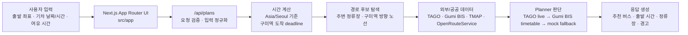

# today-bus

`today-bus`는 `구미역으로 가자` 서비스를 테스트 베드로 사용하는
repository harness dogfood 프로젝트입니다.

## 1. 서비스 소개

`구미역으로 가자`는 사용자가 현재 출발 위치와 기차 출발 날짜/시간을
입력하면, 구미역에 늦지 않기 위해 언제 출발해야 하는지 계산해주는
Next.js 앱입니다.

사용자는 지도에서 출발 좌표를 선택하고, 기차 날짜/시간과 여유 시간을
입력합니다. 백엔드는 주변 정류장, 구미역 방향 노선, 실시간 버스 도착 정보,
공식 시간표, 도보 시간을 조합해 추천 계획을 만듭니다.

핵심 사용자 흐름:

1. 출발 위치를 지도에서 선택한다.
2. 기차 출발 날짜와 시간을 입력한다.
3. 구미역 도착 전 필요한 여유 시간을 선택한다.
4. 앱이 추천 버스, 출발 시각, 탑승 정류장, fallback 이유를 보여준다.

## 2. 서비스 이미지


로컬에서 실제 화면을 확인하려면:

```bash
npm install
npm run dev
```

브라우저에서 [http://localhost:3000](http://localhost:3000)을 엽니다.

## 3. 서비스 아키텍처



백엔드 planner는 다음 순서로 동작합니다:

1. `/api/plans`가 입력값을 검증하고 정규화한다.
2. `Asia/Seoul` 기준으로 기차 출발 시간과 구미역 도착 deadline을 계산한다.
3. 출발 좌표 주변 정류장과 구미역 방향 노선 후보를 찾는다.
4. TAGO 실시간 도착, Gumi BIS 공식 시간표, walking route provider를 조합한다.
5. TAGO가 적절하면 실시간 도착 정보를 사용한다.
6. 실시간 정보가 없거나 너무 이르면 Gumi BIS timetable을 사용한다.
7. 외부 데이터가 실패하면 mock fallback으로 응답한다.

## Harness 개요

이 저장소의 중심 목적은 서비스 개발뿐 아니라, 코딩 에이전트가 변경을
안전하게 수행했는지 검증하는 harness를 dogfood하는 것입니다.

Harness가 확인하는 주요 위험:

- 구조적 제품 변경이 `docs/decisions/` 없이 지나가는지
- 재발 가능한 실패가 `docs/failures/`와 detection check 없이 남는지
- Next.js App Router, npm workflow, shared UI component 구조가 drift 되는지
- planner가 TAGO, Gumi BIS timetable, walking route, mock fallback 경로에서
  회귀하는지
- 외부 API 작업에서 secret 노출, live/mock 혼동, provider error 처리가
  빠지는지

기본 완료 gate:

```bash
npm run check:harness
```

`check:harness`는 현재 아래 순서로 실행됩니다:

```bash
npm run lint
npm run test:planner
npm run typecheck
npm run build
node scripts/check-harness.mjs
```

빠르게 planner behavior만 확인할 때는 다음 명령을 사용합니다:

```bash
npm run test:planner
```

## Harness Memory

`npm run check:harness`는 구현 경로가 바뀌었는데 `docs/decisions/` 변경이
없으면 decision-memory warning을 출력할 수 있습니다. 이 warning은 실패가
아니지만 최종 보고 전에 처리해야 합니다.

`docs/failures/*.md`를 추가하거나 수정할 때는 같은 bug path가 돌아왔을 때
무엇이 잡아내는지 테스트, fixture, script, smoke check, CI gate, 또는 manual
review point를 기록해야 합니다.

## Harness Lifecycle

`/harness` command는 starter kit reference를 읽은 뒤 target repository에 맞게
선별 적용합니다. `harness-starter-kit/`은 reference clone이며 app source가
아닙니다.

- `/harness doctor`: 현재 harness 상태와 gap 진단.
- `/harness update`: starter kit를 최신화하고 안전한 target patch만 반영.
- `/harness refresh`: 오래되거나 중복된 target harness artifact 정리.
- `/harness review`: 변경 전후의 harness, memory, verification gap 검토.

## External API Boundary

Live/public-data check는 credential, quota, provider state, network에 의존하기
때문에 기본 gate에 넣지 않습니다. 대신 deterministic fixture test를 normal
gate에 두고, live smoke는 focused command로 분리합니다.

Focused diagnostics:

```bash
npm run check:walking-route
node scripts/check-tago-backend.mjs
node scripts/check-gumi-bis-offset.mjs
```

TAGO, Gumi BIS, TMAP, OpenRouteService 작업 전에는
`docs/checklists/external-api-work.md`를 확인합니다.

## Key Paths

- App source: `src/app/`
- Shared UI: `src/components/`
- Planner logic: `src/lib/today-bus/`
- Transit providers: `src/lib/tago/`, `src/lib/gumi-bis/`, `src/lib/transit/`
- Walking providers: `src/lib/tmap/`, `src/lib/openrouteservice/`
- Local tests: `tests/`
- Harness docs: `docs/harness/`
- Harness source tracking: `.harness/source.json`

## Known Gaps

- CI는 아직 구성하지 않았습니다.
- 브라우저 smoke verification은 수동입니다.
- `docs/effectiveness/` measurement record는 아직 시작하지 않았습니다.
- live API diagnostics는 의도적으로 default harness gate 밖에 있습니다.
